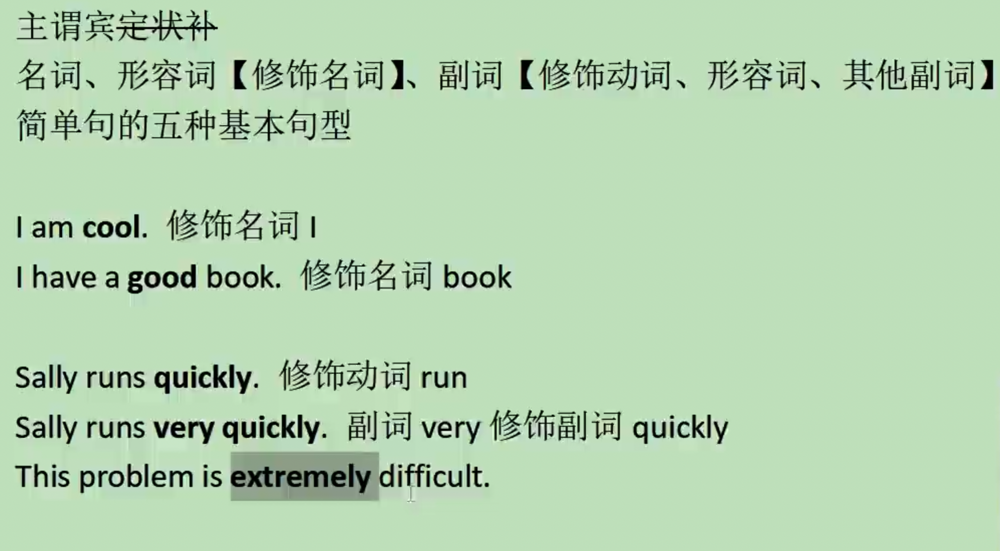

# 前言

斜体内容为个人补充内容，不涉及课堂教学。

# 018 - Larry的语法系列课程，你该怎么学？

参考链接：https://www.bilibili.com/video/BV1D1421m7o6

## 如何听课

前17节课需要听两遍以上。

学习过程中，采用输入和输出结合的方式，可以控制语法学习的粒度（不能太粗糙，也不能太抠细节）。

## 如何检测自己

判断自己的英语水平是看输出，主要看口语、写作和翻译。针对这些需要阶段性地检查。

推荐使用回译作为输出。

回译教程参考链接：https://mp.weixin.qq.com/s/rv0JO8SISXUPcDP-upn9zQ

## 是否需要购买网课

购买一门课程或者服务时，需要考虑是否能解决自身的弱点。因为英文是靠大量的输入输出来提升的，并不能通过教会你做什么就提升了。

# 023 - 英语语法回炉指南【Larry's 语法课の前传】

参考链接：https://www.bilibili.com/video/BV13v4y147P4

## 语法框架

核心就是各种词性互相修饰。

*其中的 very 我有在游戏剧情中遇到过，当时给我整得有些懵逼，但如果用语法去分析就会好一些。可能不是介词？*

## 定状补

可以这么理解：定语-形容词性成分，状语-副词性成分，补语-名词or形容词性成分

## 形容词性成分1

下面是形容词性成分比较精彩的推演：

A girl.

A pretty girl.

A extremly pretty girl.

A girl that is extremly pretty.

that 引导的定语从句，就是形容词性成分。和形容词唯一区别就是往后放。

所以可以说，定语从句就是形容词从句。

## 简单句

下面开始讲解句子：

错误改正后：

### 动词

上一图片中，系动词可以分别理解为=和≈

当然，系动词也可能不光是系动词，比如sound还可以是及物动词。

以下是五种句型：

Larry举了个例子，来讲解为什么理解上述内容很重要，可以通过快速的语法分析，搞定长难句。在24min前。

### 名词、动词和形容词做主谓宾表补

## 名词性成分

下面举例各种名词性成分：

*有提到各种名词性主语中，可以是主语从句、宾语从句、表语从句，不过我还不太清楚是如何区分的，于是有如下分析：*

*第一个是宾语从句，也是主谓宾结构。I love ... 是看从句前面的结构判断。*

*第二个是表语从句，因为是主系表结构。但这里是看从句后面的结构进行判断。（区分系动词有提到去看语法书，是固定的？）这我也分析错了，其实是主语从句，因为从句位于主语的位置，主系表结构没问题，good是表语，从句是主语。*

*第三个是补语从句，我是猜的，我分不清补语。补语是一般在宾语后，可以是n或者adj，所以我的猜测是错误的，应该是宾语从句。答案其实是表语从句，错误是因为我不知道that's it就是表语从句。*

*于是我去查了一下常见的系动词——系动词的主要功能是连接主语和表语，表明主语的状态或性质。常见的系动词包括：*

	•	be（am, is, are, was, were, been, being）
	•	become
	•	seem
	•	appear
	•	feel
	•	look
	•	sound
	•	taste
	•	smell
	•	stay
	•	remain
	•	turn

*下面是例句和讲解：*

*She is happy. （is 是系动词，happy 是表语，描述主语 She 的状态）*

*The soup tastes delicious. （tastes 是系动词，delicious 是表语，描述主语 The soup 的特征）*

*总之，系动词后面一般不跟具体的动作。*

回到课堂，名词性从句包含：主语从句+宾语从句+表语从句+同位语从句（可以看其他例句，比较好理解）

*以下是一个包含同位语从句的句子例子：*

*The fact that she won the competition surprised everyone.*

*主句: The fact surprised everyone.*

*同位语从句: that she won the competition*

*在这个句子中，“that she won the competition” 是同位语从句，它解释或说明了“the fact” 的内容。*

## 形容词性成分2

下面讲解形容词性成分：

