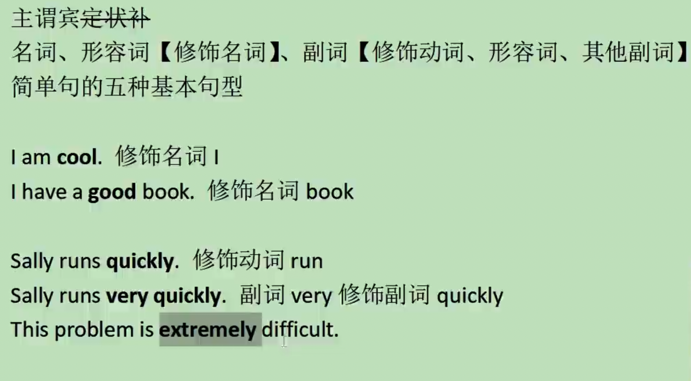

参考链接：
https://www.bilibili.com/video/BV13v4y147P4

# 018 - Larry的语法系列课程，你该怎么学？

前17节课需要听两遍以上

判断自己的英语水平是看输出，主要看口语、写作和翻译。针对这些需要阶段性地检查。

推荐使用回译作为输出。

回译教程参考链接：https://mp.weixin.qq.com/s/rv0JO8SISXUPcDP-upn9zQ

学习过程中，采用输入和输出结合的方式，可以控制语法学习的粒度（不能太粗糙，也不能太抠细节）。

购买一门课程或者服务时，需要考虑是否能解决自身的弱点。因为英文是靠大量的输入输出来提升的，并不能通过教会你做什么就提升了。

# 023 - 英语语法回炉指南【Larry's 语法课の前传】

*其中的 very 我有在游戏剧情中遇到过，当时给我整得有些懵逼，但如果用语法去分析就会好一些。可能不是介词？*

